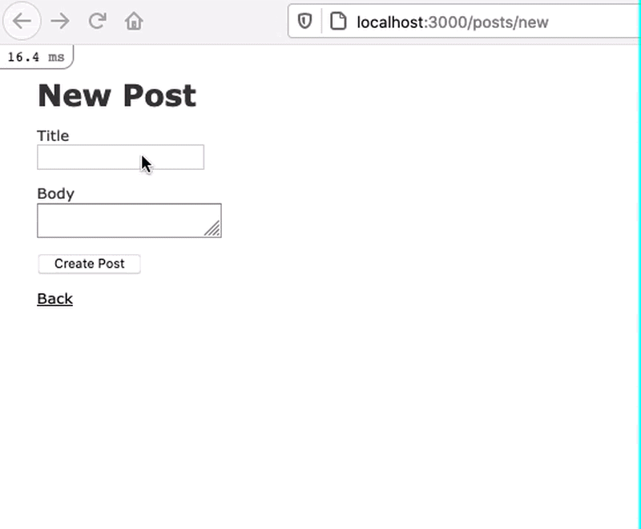
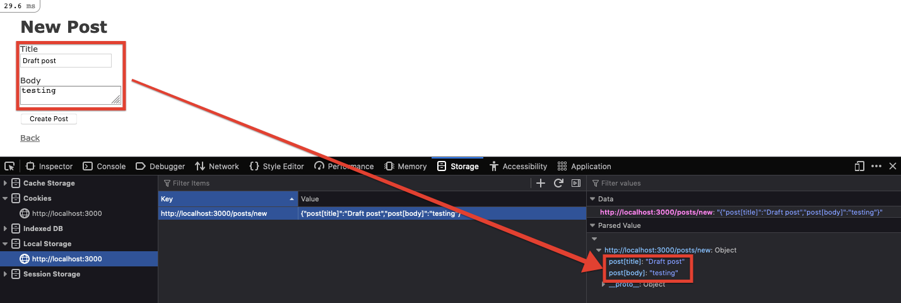

# Rails Auto Save Form Data

Automatically save form data into `localStorage` so that it can be retrieved later before submitting the form.





## Example

### Markup

```erb
<%= form_with(model: post, data: { controller: "auto-save", auto_save_target: "form", action: "change->auto-save#saveToLocalStorage submit->auto-save#clearLocalStorage" }) do |form| %>
    ...
<% end %>
```

### Stimulus Controller

```js
// app/javascript/controllers/auto_save_controller.js
import { Controller } from "stimulus"

export default class extends Controller {
    static targets = [ "form" ]

    connect() {
        // Create a unique key to store the form data into localStorage.
        // This could be anything as long as it's unique.
        // https://developer.mozilla.org/en-US/docs/Web/API/Window/localStorage
        this.localStorageKey    = window.location

        // Retrieve data from localStorage when the Controller loads.
        this.setFormData();
    }

    clearLocalStorage() {
        // See if there is data stored for this particular form.
        if(localStorage.getItem(this.localStorageKey) != null) {
            // Clear data from localStorage when the form is submitted.
            localStorage.removeItem(this.localStorageKey);
        }
    }
    
    getFormData() {
        // Construct a set of of key/value pairs representing form fields and their values.
        // https://developer.mozilla.org/en-US/docs/Web/API/FormData
        const form = new FormData(this.formTarget);
        let data = []

        // Loop through each key/value pair.
        // https://developer.mozilla.org/en-US/docs/Web/API/FormData/entries#example
        for(var pair of form.entries()) {

            // We don't want to save the authenticity_token to localStorage since that is generated by Rails.
            // https://guides.rubyonrails.org/security.html#cross-site-request-forgery-csrf
            if (pair[0] != "authenticity_token") {
                data.push([pair[0], pair[1]])
            }

        }

        // Return the key/value pairs as an Object. Each key is a field name, and each value is the field value.
        // https://developer.mozilla.org/en-us/docs/Web/JavaScript/Reference/Global_Objects/Object/fromEntries
        return Object.fromEntries(data)
    }

    saveToLocalStorage() {
        const data = this.getFormData();
        // Save the form data into localStorage. We need to convert the data Object into a String.
        localStorage.setItem(this.localStorageKey, JSON.stringify(data));
    }

    setFormData() {
        // See if there is data stored for this particular form.
        if(localStorage.getItem(this.localStorageKey) != null) {
            // We need to convert the String of data back into an Object.
            const data = JSON.parse(localStorage.getItem(this.localStorageKey));
            // This allows us to have access to this.formTarget in the loop below.
            const form = this.formTarget;
            // Loop through each key/value pair and set the value on the corresponding form field.  
            Object.entries(data).forEach((entry)=>{
                let name    = entry[0];
                let value   = entry[1];
                let input   = form.querySelector(`[name='${name}']`);
                input && (input.value = value);
            })
        }
    }
}
```

## Security Considerations

I don't recommend using this technique on forms that store sensitive data such as passwords or credit cards, since their values would be stored in plain text in `localStorage`.
